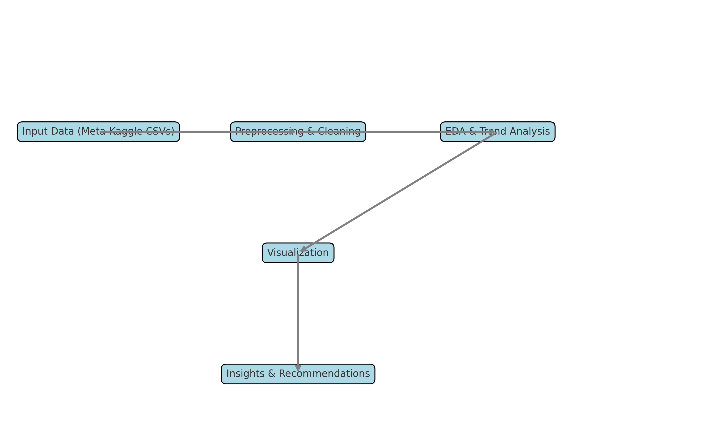

# 📊 Kaggle Innovation Trends: Historical Analysis & Forecast

This repository presents an analytical overview of Kaggle competitions over time, highlighting key patterns in participation, themes, and innovation momentum. The project includes a Jupyter Notebook, trend visualizations, and a PowerPoint presentation with insights and strategic recommendations.

---

## 📁 Repository Structure

```
.
├── kaggle-trend-over-time.ipynb       # Main notebook analyzing Kaggle competition data
├── Kaggle_Innovation_Report_Draft.pptx  # Presentation summarizing key trends & forecasts
├── data/                              # (Optional) Folder for CSVs like Competitions.csv, Submissions.csv
└── README.md                          # You're here!
```

---

## 📈 Project Objectives

- Analyze the growth of Kaggle competitions over time.
- Identify key tags and their evolution.
- Understand community engagement through team participation and submission behavior.
- Explore how incentives like prize money affect competition dynamics.
- Forecast short-term and long-term trends in Kaggle innovation.

---

## 🔍 Key Insights

- 📅 **Competition Growth**: A steady increase, especially after 2015.
- 🧠 **Popular Themes**: Computer Vision, NLP, and Time Series dominate.
- 🧑‍🤝‍🧑 **Participation**: Team counts and submissions highlight intense community engagement.
- 💰 **Prize Impact**: High-value prizes generally draw more attention—but not always linearly.
- 🔁 **Iteration Culture**: Teams often submit multiple models, indicating strong iterative development practices.

---

## 🧠 Forecast

### Short-Term (6–12 months)
- More micro-competitions with quicker turnaround.
- Greater integration of LLMs and educational resources.
- Regional and multilingual expansion.

### Long-Term (2–3 years)
- Plateau likely without new competition formats.
- Shift towards ML Ops, deployment challenges, and real-time tasks.
- Deeper community integration via reusable pipelines and agent-based challenges.

---

## 🛠️ Requirements

To run the notebook locally:

```bash
pip install pandas matplotlib seaborn jupyter
```

If running it via Kaggle, download competition metadata files:
- `Competitions.csv`
- `CompetitionTags.csv`
- `Tags.csv`
- `Submissions.csv`


---

## 🧾 How to Use

1. Clone the repo:
   ```bash
   git clone https://github.com/yourusername/kaggle-innovation-trends.git
   cd kaggle-innovation-trends
   ```

2. Launch the notebook:
   ```bash
   jupyter notebook kaggle-trend-over-time.ipynb
   ```

3. Review the PowerPoint:
   Open `Kaggle_Innovation_Report_Draft.pptx` for a strategic summary of the analysis.

---

## 🗺️ Schematic Overview



> This diagram summarizes the flow from Kaggle data to insight generation and strategic forecasting.

---

## 📄 License

MIT License. Feel free to use and adapt this project with attribution.

---

## 🤝 Contributing

Contributions, insights, and suggestions are welcome! Submit an issue or a pull request to help improve this project.

---

## 📬 Contact

**[Michel M. Nzikou]**  
[michel.nzikou@alumni.uleth.ca]
[https://www.linkedin.com/in/michel-nzikou/]
